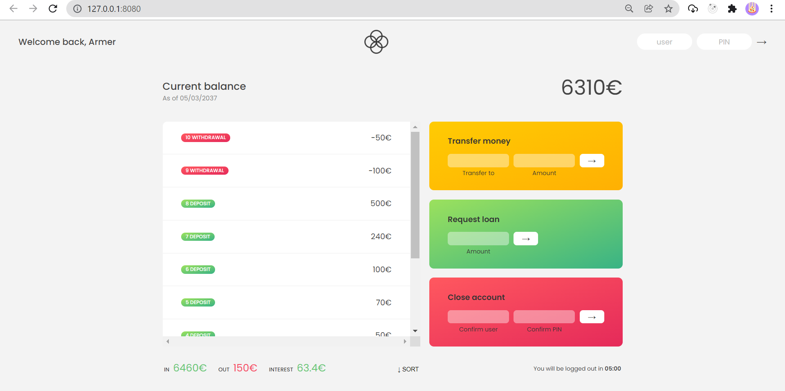

# BANKIST

> I'll transfer my money to you (OFC fake money 😜)

---

### Table of Contents

You're sections headers will be used to reference location of destination.

- [Description](#description)
- [How To Use](#how-to-use)
- [References](#references)
- [Author Info](#author-info)

---

## Description

This app trying to duplicate Bank process. You can transfer money, request loan and close your account. [Go Try live demo](https://bankist.netlify.app/), fake _log in_ with user **js** and PIN **1111**.

#### Technologies

- Javascript
- HTML
- CSS

[Back To The Top](#read-me-template)

---

## How To Use

### Flowchart

[Back To The Top](#read-me-template)

---

## References

- [HTML & CSS](https://github.com/jonasschmedtmann/complete-javascript-course)

[Back To The Top](#read-me-template)

---

## Author Info

- Twitter - [@armerayfrndy](https://twitter.com/armerayfrndy)
- LinkedIn - [@armeray](https://www.linkedin.com/in/armer-ray-aa1b2411b/)

[Back To The Top](#read-me-template)
